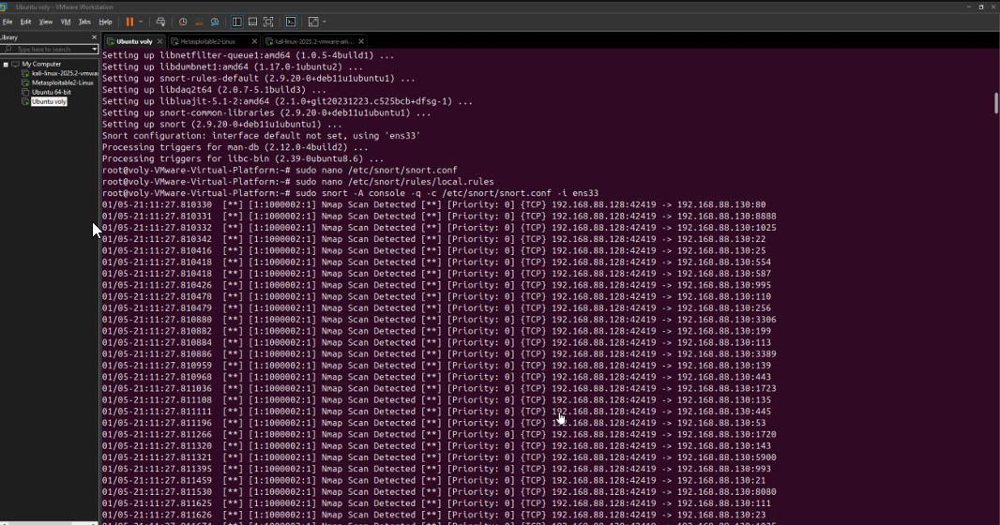
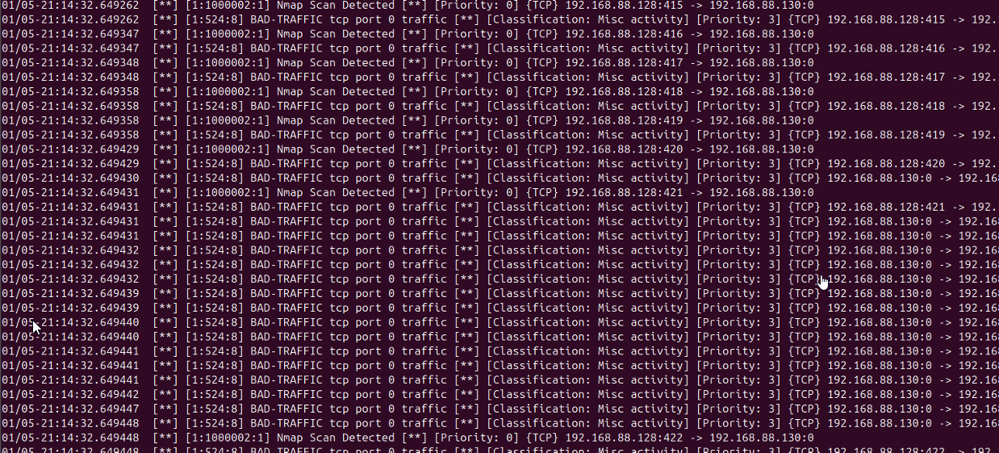
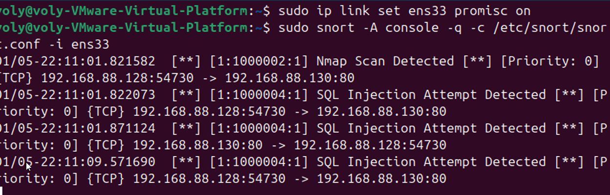
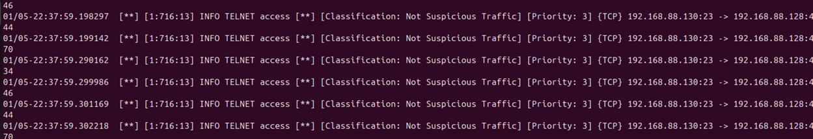

# Snort IDS Deployment and Network Threat Detection

## Overview
This project demonstrates the deployment and configuration of **Snort** as an Intrusion Detection System (IDS) within a controlled network environment. The primary objective is to establish robust network monitoring, detect reconnaissance activities, analyze traffic anomalies, and identify application-layer attacks.

## Environment Architecture
The testing environment consists of three virtualized components:
- **Attacker Node:** Kali Linux
- **IDS Server:** Ubuntu (running Snort in Promiscuous mode)
- **Target Node:** Metasploitable 2

## Methodology
The implementation involved configuring the network interface (`ens33`) in promiscuous mode to ensure full traffic visibility across the segment. Snort was configured to act as a passive monitor, utilizing a set of custom detection rules to identify specific attack signatures.

### 1. Network Reconnaissance Detection
Utilized `Nmap` to perform service discovery and vulnerability scanning against the target. The IDS successfully triggered alerts for Nmap-based scanning activities.


### 2. Denial of Service (DoS) Mitigation
Simulated a DoS attack by flooding the target with TCP SYN packets using `hping3`. Snort identified the high-volume traffic and flagged it as `BAD-TRAFFIC`.


### 3. Application Layer Analysis (SQL Injection)
Executed SQL injection payloads against the target application. Snort was configured with custom rules to detect malicious `union select` patterns, effectively identifying and logging the injection attempts.


### 4. Brute Force Detection (Telnet)
Conducted a password brute-force attack on the Telnet service (port 23) using `Hydra`. The system monitored the authentication attempts and logged the access patterns.


## Custom Snort Rules
The following rules were implemented in `/etc/snort/rules/local.rules` to facilitate detection:

```bash
# ICMP Ping Detection
alert icmp any any -> $HOME_NET any (msg: "ICMP Ping Detected"; sid: 1000001; rev:1;)

# Nmap Scan Detection
alert tcp any any -> $HOME_NET any (msg: "Nmap Scan Detected"; flags:S; sid:1000002; rev:1;)

# SQL Injection Detection
alert tcp any any -> $HOME_NET 80 (msg: "SQL Injection Attempt Detected"; content: "union select"; nocase; sid:1000003; rev:1;)
Conclusion
This project demonstrates the effectiveness of Snort IDS in providing deep visibility into network traffic. By implementing specific signature-based rules and ensuring proper interface configuration, it is possible to create a reliable monitoring framework capable of detecting diverse threat vectors ranging from reconnaissance to sophisticated application-layer attacks.

Presented by: Abdul Aziz Taiba
